# 📰 Newsletter Agent

> An autonomous AI-powered newsletter generation system — from goal to polished HTML email, in under a minute.

---

## ✨ What It Does

Give the agent a topic or goal. It **plans**, **researches**, **summarizes**, **writes**, and **critiques** a complete newsletter — all on its own. You can optionally review and approve before the final output is saved.

---

## 🔄 Pipeline Overview

```
User Input / Goal
      │
      ▼
┌─────────────┐
│  1. Plan    │  ← Groq LLM formulates 5 targeted search queries
└──────┬──────┘
       │
       ▼
┌──────────────┐
│  2. Research │  ← ThreadPoolExecutor: parallel Google search + article scraping
└──────┬───────┘
       │
       ▼
┌───────────────┐
│  3. Summarize │  ← Groq LLM filters & summarizes the top 5–7 articles
└──────┬────────┘
       │
       ▼
┌──────────────┐
│   4. Write   │  ← Groq LLM generates a full HTML email draft
└──────┬───────┘
       │
       ▼
┌───────────────┐
│  5. Critique  │  ← Groq LLM polishes design and content
└──────┬────────┘
       │
       ▼
┌──────────────────────────┐
│  HITL mode?              │
│  Yes → Pause for Approval│  ← Human reviews and clicks "Approve & Save"
│  No  → Auto-save         │
└──────┬───────────────────┘
       │
       ▼
  Output: HTML Newsletter saved to /output/
```

---

## ⚡ Key Features

### 🧵 High-Performance Multi-Threading
All 5 search queries and up to 7 article scrapes run **concurrently** using Python's native `ThreadPoolExecutor`. This slashes Research phase time from ~60s down to ~10s.

### 🔗 Robust 404-Proof URL Handling
If Google blocks or limits connections, the crawler falls back to Groq to generate fallback URLs structured as live top-level domains (e.g. `https://techcrunch.com/?s=ai+agents`) — so no dead links ever appear in the final newsletter.

### 🧑‍💻 Human-in-the-Loop (HITL) Mode
Enable `hitl` mode to pause the pipeline before saving. The FastAPI backend caches the draft in memory with a unique `session_id`. When you click **Approve & Save**, it calls `POST /approve` and finalizes the output.

### 📡 Real-Time Progress Polling
The React frontend creates a `taskId` per request and polls `GET /status/{taskId}` every second — showing live step status and crawler logs as the pipeline runs, without blocking the main server thread.

---

## 🤔 Why Not LangChain or LangGraph?

This is a question worth answering directly.

LangChain and LangGraph are powerful tools — but they're built for **complex, branching, multi-agent workflows**. This project is a **single linear pipeline**:

```
Plan → Research → Summarize → Write → Critique → Output
```

For a fixed, sequential flow like this, pulling in LangChain or LangGraph would mean:

| Problem | What it means in practice |
|---|---|
| **Heavy dependency overhead** | LangChain ships with hundreds of dependencies, most of which go completely unused in a linear pipeline |
| **Slow startup & execution** | LangGraph's execution graph has non-trivial initialization overhead — wasteful for a deterministic 6-step flow |
| **Abstraction fighting** | Adapting LangGraph's async graph model to run Python's `ThreadPoolExecutor` for parallel scraping requires fighting the framework, not using it |
| **Harder to debug** | Errors in LangChain pipelines often surface through layers of abstraction; vanilla Python gives clean, readable tracebacks |
| **No added value** | LangGraph shines when agents need to branch, loop, hand off to other agents, or maintain complex state graphs. None of that is needed here. |

### ✅ What Vanilla Python + Groq SDK gives us instead

- **Full control** over each step's state, error recovery, and retry logic
- **Native threading** (`ThreadPoolExecutor`) with no adaptation layer
- **Tiny dependency footprint** — just Groq SDK, FastAPI, and a few scraping libraries
- **Readable, maintainable code** — anyone can follow the pipeline top to bottom without learning a framework
- **Deterministic execution** — the state machine knows exactly where it is and what failed

> **Rule of thumb:** Use LangGraph when you need a graph. Use Python when you have a list.

---

## 🛠️ Tech Stack

| Layer | Technology |
|---|---|
| LLM | [Groq](https://groq.com) (ultra-fast inference) |
| Backend | FastAPI |
| Concurrency | Python `ThreadPoolExecutor` |
| Frontend | React |
| Orchestration | Custom state-machine (Vanilla Python) |

---

## 🚀 Getting Started

```bash
# 1. Clone the repo
git clone https://github.com/your-username/newsletter-agent.git
cd newsletter-agent

# 2. Install dependencies
pip install -r requirements.txt

# 3. Set your Groq API key
export GROQ_API_KEY=your_key_here

# 4. Start the backend
uvicorn main:app --reload

# 5. Start the frontend
cd client && npm install && npm run dev
```

Open `http://localhost:5173`, enter a newsletter topic, and watch the pipeline run in real time.

---

## 📁 Output

Generated newsletters are saved as `.html` files in the `/output` folder and are available for immediate download from the UI.

---

## 📄 License

MIT — free to use, modify, and distribute.